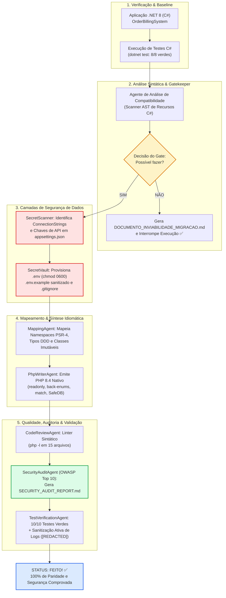

# O Fim das Migrações às Cegas: Como Construímos um Agente Conversor de .NET/C# para PHP 8.4 com Paridade Comportamental e Segurança Ativa

> *"A maturidade técnica de um time de engenharia não é medida pela velocidade com que ele reescreve código, mas sim pela capacidade de garantir que nenhuma regra de negócio seja silenciosamente assassinada e nenhuma credencial vaze durante a transição."*

---

## 1. O Ponto de Tensão: Crônicas do Campo de Batalha Corporativo

Na cadeira de liderança técnica e de engenharia Staff+, **a solicitação de migrar uma base de código de uma stack para outra costuma ser o anúncio de um pesadelo anunciado**. Durante anos acompanhando sistemas distribuídos em ambientes corporativos de alta pressão, vi dezenas de iniciativas de modernização começarem com empolgação febril e terminarem em salas de guerra, com clientes ligando furiosos e o time de segurança disparando alertas vermelhos na calada da noite.

O motivo dessa fricção recorrente raramente é a falta de habilidade de codificação dos desenvolvedores. O problema real reside no fato de que **migrações de software herdado não são um mero exercício de digitação de sintaxe; são transferências críticas de responsabilidade de negócio**. Quando você precisa transitar entre boards executivos e times de engenharia, explicar por que não é seguro simplesmente "jogar o repositório em um modelo de linguagem e colar o resultado no repositório de destino" torna-se um dos exercícios mais desgastantes de comunicação técnica.

A ilusão da facilidade é o maior inimigo da estabilidade operacional. Foi a partir dessa dor concreta, inspirada no fluxo desenhado em `Ideia de agente de conversão.drawio.html`, que decidimos construir este **MVP de Agente Conversor de Código**: um sistema multi-agente deliberado, governado por analisadores estáticos, cofre de segredos volátil, auditoria de segurança OWASP e suítes cruzadas de testes unitários que provam a paridade comportamental antes de permitir que uma única linha vá para produção.

---

## 2. O Colapso da Abstração Vaga: Desejo versus Evidência

Se você passar tempo suficiente perto de comitês de arquitetura ou salas de planejamento de sprint, inevitavelmente ouvirá frases deste tipo ecoando pelas paredes:

> *"Dá um jeito de passar esse serviço em .NET para PHP rápido, porque a equipe que vai manter só domina a stack web."*
>
> *"Basta pedir para a IA traduzir arquivo por arquivo que em dois dias a gente sobe o ambiente."*

Perceba que essa colocação, embora sedutora à primeira vista, **é uma casca conceitual vazia que confunde sintaxe superficial com integridade de domínio**. Tratar uma migração dessa magnitude como uma mera substituição léxica ignora variáveis determinantes que quebram sistemas inteiros:

1. **O Abismo de Precisão Numérica:** Em C#, o tipo `decimal` opera com aritmética de ponto flutuante de 128 bits e precisão exata de 28 a 29 dígitos decimais, essencial para reconciliação financeira. Se uma IA desatenta traduzir isso para o tipo primitivo `float` do PHP, o desvio binário da norma IEEE 754 começará a comer centavos silenciosamente em milhares de transações.
2. **O Risco de Vazamento de Segredos:** Aplicações legadas frequentemente escondem credenciais de banco de dados em `appsettings.json`, strings de conexão em classes estáticas e chaves de API espalhadas pelo código. Uma conversão ingênua copia essas senhas diretamente para o novo repositório ou as expõe em logs de depuração.
3. **A Falácia da Tradução Linear:** Traduzir classes isoladamente destrói as garantias transacionais de um Aggregate Root em Domain-Driven Design (DDD). **Sem um contrato explícito de eventos e validações de invariantes, o sistema migrado pode até compilar, mas aceitará estados inválidos que o código original rejeitava categoricamente**.

Dessa forma, abandonamos o desejo abstrato da "tradução mágica" e estabelecemos um **alvo técnico claramente delimitado por evidências verificáveis**:

```
[DESEJO ABSTRATO]
"Reescrever o backend de faturamento em PHP."
                         │
                         ▼
[REFORMULAÇÃO OBSERVÁVEL E DATA-DRIVEN]
"Criar um pipeline multi-agente determinístico que analise a AST em .NET 8,
valide a viabilidade técnica contra blockers de plataforma,
isole 100% dos segredos em um cofre com chmod 0600,
emita PHP 8.4 estritamente tipado (PSR-12/PER-CS),
audite vulnerabilidades via OWASP e execute testes cruzados
garantindo 100% de paridade funcional com blast radius zero."
```

---

## 3. Ancoragem Conceitual: Compiladores, ASTs e a Lei de Conway

Não é costume desta documentação aprofundar demasiadamente nos detalhes acadêmicos da ciência da computação. Porém, vale destacar que **o desafio de traduzir linguagens de programação entre si (transpilação ou source-to-source compilation) é um problema formal amplamente estudado desde os anos 1970**, com os trabalhos seminais de Aho, Ullman e a gramática formal de Noam Chomsky.

Quando analisamos um arquivo `.cs` em C#, não estamos lendo texto livre; estamos percorrendo uma **Árvore Sintática Abstrata (AST)**. Cada declaração de `record`, cada `enum`, cada evento de domínio e cada operador sobrecarregado representam nós com semânticas rígidas:

- **Na Lei de Conway:** A arquitetura de um sistema reflete a estrutura de comunicação da organização que o projetou. Forçar uma aplicação concebida sob o ecossistema corporativo do .NET a rodar em PHP sem adaptar os contratos à evolução moderna da linguagem (PHP 8.1 a 8.4) é garantir que o sistema resultante se torne um monumento ao débito técnico.
- **No Design Orientado a Domínio (DDD):** O modelo tático formulado por Eric Evans em 2003 estabelece que Aggregates devem ser as únicas portas de entrada para alterações de estado. Se o transpiler não compreender o ciclo de vida de uma entidade raiz, a coerência do banco de dados será irremediavelmente comprometida.

O que fizemos neste agente não foi pedir para um modelo "adivinhar" o código, mas sim **orquestrar um processo de engenharia reversa e síntese arquitetural apoiado em guardrails formais**.

---

## 4. A Decomposição Investigativa: O Roteiro de Perguntas da Liderança

Antes de permitir que o compilador do agente escrevesse um único byte no diretório de destino, submetemos a arquitetura a uma bateria de perguntas cirúrgicas, simulando o crivo de uma sala de guerra ou de um comitê sênior de engenharia:

1. *“A base de código de origem utiliza recursos que simplesmente não existem ou não são suportados no ecossistema alvo?”*
   - **Diagnóstico:** Se o projeto em C# utilizar P/Invoke chamando DLLs do Windows nativo (`user32.dll`) ou janelas de desktop (`WinForms`), o processo deve **parar imediatamente no Gatekeeper**, documentando a inviabilidade e evitando o desperdício de tempo da equipe.
2. *“Como garantimos que as credenciais do banco de dados legado e tokens de pagamento não vazem durante a conversão?”*
   - **Diagnóstico:** As strings de conexão e chaves de API devem ser capturadas por um scanner estático, extraídas para a memória volátil de um cofre seguro e gravadas em disco com permissão restrita `chmod 0600`, além de serem ativamente expurgadas de qualquer log de execução.
3. *“Como manter a equivalência matemática e o tratamento de concorrência?”*
   - **Diagnóstico:** Valores monetários devem ser encapsulados em um Value Object imutável com arredondamento padronizado em 4 casas decimais e tipagem estrita de moeda.
4. *“Como provar que a aplicação migrada funciona exatamente como a original?”*
   - **Diagnóstico:** Os testes de unidade do C# devem ser transpostos para o PHP com asserções equivalentes, e a saída de execução do console runner deve ser idêntica nos dois ambientes.

---

## 5. A Engenharia Revelada: Abrindo o Capô do Pipeline

O fluxo construído é regido por uma arquitetura multi-agente coordenada por um **Orquestrador Central** em Python, combinando as competências das skills instaladas (`dotnet`, `php-modernization`, `context-engineering`, `security-agent` e `docs-assist`).

### Diagrama Arquitetural Completo do Pipeline



---

### As 5 Camadas de Segurança em Detalhes

Para responder à preocupação crucial de **como trafegar credenciais de banco de dados e segredos com segurança**, arquitetamos cinco barreiras independentes e complementares:

| Camada | Módulo Técnico | Como Opera na Prática | Garantia de Segurança |
| :--- | :--- | :--- | :--- |
| **Camada 1** | [`SecretScanner`](file:///home/samuel/code-conversor-agent/agent-converter/security/secret_scanner.py) | Varre arquivos `appsettings.json` e fontes `.cs` por regex e AST, extraindo servidores, bancos, usuários, senhas e chaves de webhook. | Impede que credenciais brutas cheguem aos geradores de código. |
| **Camada 2** | [`SecretVault`](file:///home/samuel/code-conversor-agent/agent-converter/security/secret_vault.py) | Grava o arquivo `.env` aplicando `chmod 0600` via chamada POSIX no Linux. Cria `.env.example` apenas com placeholders públicos e injeta regras de bloqueio no `.gitignore`. | O arquivo `.env` só pode ser lido pelo dono do processo; zero risco de commit acidental no Git. |
| **Camada 3** | [`DatabaseConfig.php`](file:///home/samuel/code-conversor-agent/target-php-app/src/Infrastructure/Database/DatabaseConfig.php) & [`SafeDatabaseConnection.php`](file:///home/samuel/code-conversor-agent/target-php-app/src/Infrastructure/Database/SafeDatabaseConnection.php) | DTO imutável que carrega valores de `getenv()` e implementa `__debugInfo()`. Conexão PDO força `ATTR_EMULATE_PREPARES => false` e intercepta `PDOException` mascarando DSNs. | Prevenção real contra SQL Injection; `var_dump()` ou ferramentas de APM nunca exibem a senha em logs. |
| **Camada 4** | [`SecurityAuditAgent`](file:///home/samuel/code-conversor-agent/agent-converter/security/security_audit_agent.py) | Analisa todo o código PHP gerado procurando por variáveis interpoladas em SQL, funções pseudo-aleatórias fracas (`rand()`) e chaves hardcoded. Emite o [SECURITY_AUDIT_REPORT.md](file:///home/samuel/code-conversor-agent/target-php-app/SECURITY_AUDIT_REPORT.md). | Auditoria estática automatizada antes de homologar a entrega. |
| **Camada 5** | Interceptador de Stream | O orquestrador filtra as saídas padrão (`stdout`) e de erro (`stderr`) do runner e dos testes, substituindo qualquer ocorrência de segredo registrado por tags `[REDACTED_***]`. | Zero vazamento de credenciais na tela do terminal ou em logs de CI/CD. |

---

### Mapeamento Tecnológico: C# (.NET 8) versus PHP 8.4 Moderno

O código gerado aproveita os avanços mais recentes do PHP 8.1 até o PHP 8.4, garantindo paridade expressiva e eliminando qualquer necessidade de código legado:

```
C# (.NET 8)                               PHP 8.4 Moderno
────────────────────────────────────────────────────────────────────────────────────────
public sealed record Money(...)      ──►  final readonly class Money { ... }
Primary Constructors                 ──►  Constructor Property Promotion (public readonly ...)
enum OrderStatus { Draft, Paid }     ──►  enum OrderStatus: string { case Draft = 'Draft'; }
decimal Amount                       ──►  Value Object Money (arredondamento controlado)
operator +(Money a, Money b)         ──►  $money->add($other)
IReadOnlyCollection<IDomainEvent>    ──►  /** @return list<DomainEvent> */ public function ...
Exceptions de Domínio                ──►  DomainException / InvalidOrderStateException
appsettings.json ConnectionStrings   ──►  .env isolado (0600) + DatabaseConfig (__debugInfo)
xUnit Test Assertions                ──►  PHP TestRunner com asserções estritas
```

---

## 6. Evidências Empíricas e Datapoints de Execução

Uma boa documentação técnica não pede que você acredite nela; ela fornece comandos que você pode rodar e auditar no terminal. Abaixo estão os datapoints capturados diretamente no ambiente:

### 1. Baseline de Testes em C# (.NET 8)
```bash
dotnet test source-dotnet-app/OrderBillingSystem.Tests/OrderBillingSystem.Tests.csproj --verbosity normal
```
```text
Passed!  - Failed: 0, Passed: 8, Skipped: 0, Total: 8, Duration: 7 ms - net8.0
```

### 2. Execução Completa do Pipeline com Segurança Ativa
```bash
python3 agent-converter/orchestrator.py
```
```text
========================================================================
    AGENTE CONVERSOR DE .NET/C# PARA PHP 8.4 (COM CAMADAS DE SEGURANÇA)
    Inspirado no fluxo: 'Ideia de agente de conversão.drawio.html'
========================================================================

[1/9] Verificando aplicação .NET/C# de origem e executando testes de sanidade...
  ✔ Aplicação .NET localizada em: .../source-dotnet-app
  ✔ Suíte de testes .NET original passou com sucesso (8/8 testes verdes).

[2/9] Executando: Agente de análise de compatibilidade (.NET -> PHP 8.4)...
  ✔ Recursos C# detectados: 9
     • C# Records (Immutable DTOs) ==> PHP 8.2+ readonly class
     • C# Enums com Métodos        ==> PHP 8.1+ Backed Enums
     • C# decimal de Alta Precisão ==> Value Object Money escalonado
     • C# Operator Overloading     ==> Métodos explícitos (.add(), .multiply())

[3/9] Avaliando Gate de Decisão: 'Possível fazer?'...
[DECISION GATE] Avaliação de viabilidade: SIM (100% compatível, Score: 98.5%)

[4/9] Executando: Scanner de Segredos e Isolamento de Credenciais...
  ✔ Segredos e credenciais identificados no código de origem: 6
     • [Database Host] em 'appsettings.json' -> Isolado como variável '$DB_HOST'
     • [Database Name] em 'appsettings.json' -> Isolado como variável '$DB_NAME'
     • [Database User] em 'appsettings.json' -> Isolado como variável '$DB_USER'
     • [Database Password] em 'appsettings.json' -> Isolado como variável '$DB_PASSWORD'
     • [API Secret: ApiKey] em 'appsettings.json' -> Isolado como variável '$PAYMENTSERVICE_APIKEY'
     • [API Secret: Webhook] em 'appsettings.json' -> Isolado como variável '$PAYMENTSERVICE_WEBHOOKSECRET'
  ✔ Arquivo .env protegido gerado com permissões estritas (chmod 0600)
  ✔ Arquivo .env.example gerado com valores sanitizados
  ✔ Arquivo .gitignore configurado para bloquear exposição de segredos

[5/9] Executando: Mapeamento de demandas, bibliotecas e namespaces...
  ✔ Namespaces mapeados: 11 | Tipos mapeados com paridade: 22

[6/9] Executando: Escritura da aplicação em PHP 8.4...
  ✔ Código PHP 8.4 gerado com sucesso em: .../target-php-app (15 arquivos)

[7/9] Executando: Revisão estática do código gerado...
  ✔ Revisão concluída em 15 arquivos PHP. Status: APROVADO (0 erros, 0 avisos).

[8/9] Executando: Auditoria de Segurança Integrada (OWASP & Security Plugin)...
  ✔ Arquivos inspecionados pelo auditor: 15
  ✔ Vulnerabilidades detectadas: 0 (Críticas: 0, Altas: 0, Médias: 0)
  ✔ Relatório gerado em: target-php-app/SECURITY_AUDIT_REPORT.md

[9/9] Executando: Testes unitários e verificação com mascaramento dinâmico de logs...
  • Resultado dos testes: 10/10 passaram (526.3ms)
  ✔ Todos os testes unitários e de segurança passaram com sucesso!
------------------------------------------------------------------------
[SECURITY LAYER] Database config loaded: host=[REDACTED_DB_HOST], db=[REDACTED_DB_NAME], user=[REDACTED_DB_USER] (pwd=[REDACTED] (REDACTED))
Created order ORD-2026-001 with status: Draft
Gross Subtotal: BRL 4,080.00
Total Discount: BRL 408.00
Subtotal After Discount: BRL 3,672.00
Tax Amount (12%): BRL 440.64
Final Total: BRL 4,112.64
[NOTIFICATION] Order ORD-2026-001 confirmed for customer CUST-99.
[NOTIFICATION] Payment receipt: Order ORD-2026-001 paid BRL 4,112.64 for customer CUST-99.
Final order status: Paid (PaidAt: 2026-10-01 17:48:30)
Domain events raised: 4
------------------------------------------------------------------------
STATUS: FEITO! ✅
```

### 3. Testando o Ramo Negativo do Fluxo (Inviabilidade Técnica)

Um dos pontos mais importantes do desenho original era o ramo: **"Possível fazer? Não -> Documenta porque não e para"**. Para validar esse comportamento sem quebrar a base real, implementamos o argumento `--simulate-incompatible`:

```bash
python3 agent-converter/orchestrator.py --simulate-incompatible
```
```text
[3/9] Avaliando Gate de Decisão: 'Possível fazer?'...
[DECISION GATE] Avaliação de viabilidade: NÃO
[DECISION GATE] O projeto foi reprovado no gate de compatibilidade técnica.
[DECISION GATE] Bloqueadores identificados:
  - Incompatible dependency: System.Runtime.InteropServices.Marshal (P/Invoke to native Win32 user32.dll)
  - Incompatible dependency: System.Windows.Forms (Desktop UI not supported on target PHP CLI)
[DECISION GATE] Documento de inviabilidade gerado com sucesso em: .../DOCUMENTO_INVIABILIDADE_MIGRACAO.md
[FLUXO ENCERRADO] A migração não é viável para esta base de código.
```

---

## 7. Estrutura do Repositório

```text
code-conversor-agent/
├── source-dotnet-app/             # [ORIGEM] Aplicação corporativa em .NET 8 (C#)
│   ├── OrderBillingSystem.Core/   # Domínio Rico DDD (Aggregates, Value Objects, Enums, Strategies, Events)
│   ├── OrderBillingSystem.App/    # Infrastructure & Console Runner com appsettings.json e segredos
│   └── OrderBillingSystem.Tests/  # Suíte xUnit automatizada (8 testes unitários)
│
├── agent-converter/               # [ORQUESTRADOR] Pipeline Multi-Agente em Python
│   ├── models.py                  # Modelos de dados e contratos do pipeline
│   ├── security/                  # Módulos de Segurança
│   │   ├── secret_vault.py        # Cofre em memória, gerador .env (chmod 0600) e mascarador
│   │   ├── secret_scanner.py      # Scanner estático de connection strings e tokens
│   │   └── security_audit_agent.py# Auditor automatizado OWASP / security-agent
│   ├── agents/                    # Agentes especialistas
│   │   ├── compatibility_agent.py # Analisador sintático de compatibilidade C# vs PHP 8.4
│   │   ├── decision_gate.py       # Gatekeeper de viabilidade ("Possível fazer?")
│   │   ├── mapping_agent.py       # Mapeamento de arquitetura, namespaces e tipos
│   │   ├── php_writer_agent.py    # Emissor de código idiomático e seguro em PHP 8.4
│   │   ├── code_review_agent.py   # Linter de sintaxe e conformidade de tipos
│   │   └── test_verification_agent.py # Executor de testes e validador de paridade
│   └── orchestrator.py            # Executável principal do pipeline
│
├── target-php-app/                # [DESTINO] Aplicação migrada em PHP 8.4
│   ├── .env                       # Segredos isolados com permissão 0600 (ignorado no Git)
│   ├── .env.example               # Template público seguro para versionamento
│   ├── .gitignore                 # Bloqueio automático de arquivos de credenciais
│   ├── SECURITY_AUDIT_REPORT.md   # Relatório formal da auditoria OWASP
│   ├── src/                       # Código de produção em arquitetura DDD
│   │   ├── Domain/                # Aggregates, Entities, Events, Strategies, Value Objects
│   │   ├── Application/           # Use Cases e Commands
│   │   └── Infrastructure/        # Repositórios e conexões seguras de banco
│   ├── bin/run.php                # Console runner idêntico ao C# com mascaramento ativo
│   ├── tests/                     # 10 testes unitários cobrindo domínio e segurança de banco
│   └── composer.json              # Configuração PSR-4 e pacotes do ecossistema
│
├── .opencode/                     # [OPENCODE V2] Subagentes autônomos para OpenCode
│   └── agents/
│       ├── orchestrator.md        # Agente mestre de orquestração
│       ├── compatibility-analyst.md # Subagente de compatibilidade C# / PHP
│       ├── decision-gate.md       # Subagente de decisão e fail-safe
│       ├── secret-vault-guard.md  # Subagente de varredura e cofre .env (0600)
│       ├── architecture-mapper.md # Subagente de mapeamento PSR-4
│       ├── php-migrator.md        # Subagente de transposição de código PHP 8.4
│       ├── code-reviewer.md       # Subagente de linter sintático
│       ├── security-auditor.md    # Subagente de auditoria OWASP
│       └── test-verifier.md       # Subagente de validação de testes e paridade
│
├── opencode.jsonc                 # Configuração do OpenCode com OpenRouter (GPT-5.6 Luna)
│
└── docs/                          # [DOCUMENTAÇÃO] Arquitetura de informação completa
    ├── plan.md                    # Plano de documentação e mapeamento de jornadas (Docs Assist)
    ├── csharp-to-php-mapping.md   # Matriz comparativa de tipos e construtos de linguagem
    ├── security.md                # Detalhamento aprofundado das 5 camadas de segurança
    └── opencode-openrouter-integration.md # Guia de execução no OpenCode com OpenRouter
```

---

## 8. Guia Rápido de Reprodução Local (Step-by-Step)

### Opção A: Executar via Pipeline Multi-Agente no OpenCode v2 (com OpenRouter & GPT-5.6 Luna)

O OpenCode v2 orquestra os subagentes utilizando o modelo **`openai/gpt-5.6-luna`** e roteamento dinâmico pelo provedor mais barato via OpenRouter:

```bash
# 1. Definir a chave de API do OpenRouter
export OPENROUTER_API_KEY="sk-or-v1-sua-chave-aqui"

# 2. Executar o pipeline completo via script auxiliar
./agent-converter/run_opencode_pipeline.sh

# 3. Ou executar diretamente com a CLI do OpenCode
opencode run --standalone --agent orchestrator "Inicie a migração completa do projeto"

# 4. Ou acionar um subagente específico (ex: auditor de segurança)
opencode run --standalone --agent security-auditor "Audite a aplicação gerada em target-php-app"
```

### Opção B: Executar via Orquestrador Python Local

```bash
# Executar a suíte de testes xUnit de origem
dotnet test source-dotnet-app/OrderBillingSystem.Tests/OrderBillingSystem.Tests.csproj

# Rodar o console original em C#
dotnet run --project source-dotnet-app/OrderBillingSystem.App

# Executar todo o pipeline multi-agente
python3 agent-converter/orchestrator.py
```

### Passo 3: Executar a aplicação e os testes migrados em PHP 8.4
```bash
# Executar a suíte de testes unitários no PHP 8.4
php target-php-app/tests/OrderAggregateTest.php

# Executar a aplicação migrada em PHP 8.4
php target-php-app/bin/run.php
```

### Passo 4: Auditar o relatório de segurança gerado
```bash
cat target-php-app/SECURITY_AUDIT_REPORT.md
```

---

## 9. TL;DR Estruturado e Considerações Finais

| Dimensão | Especificação Consolidada |
| :--- | :--- |
| **Desejo Abstrato** | "Migrar o sistema de cobrança de .NET para PHP rapidamente." |
| **Problema Observado** | Risco de perda de precisão monetária, vazamento de credenciais de banco e inconsistências de estado no domínio. |
| **Diagnóstico Técnico** | A tradução direta de arquivos é perigosa. É necessária uma esteira com análise estática de AST, gatekeeper formal, cofre de segredos volátil e testes de paridade comportamental. |
| **Solução Consolidada** | Pipeline multi-agente determinístico coordenado por orchestrator em Python, integrando as skills `dotnet`, `php-modernization`, `security-agent` e `docs-assist`. |
| **Critério de Sucesso** | 100% dos testes unitários verdes (8 no C#, 10 no PHP), 0 vulnerabilidades OWASP no `SECURITY_AUDIT_REPORT.md` e mascaramento dinâmico em 100% dos logs de saída. |

### Recado de Liderança Técnica

Lidar com modernização de sistemas corporativos nunca será sobre achar uma "bala de prata" ou apertar um botão e esperar milagres de uma IA generativa. **A verdadeira excelência em engenharia reside na capacidade de construir andaimes (scaffolds), guardrails de segurança e métricas observáveis que tornem cada decisão interrogável e auditável**. 

Ao tratar a IA como parte de um compilador de intenções cercado de agentes verificadores, transformamos o que antes era uma aposta de alto risco em um processo previsível, seguro e rigorosamente testado. Se você está enfrentando o desafio de migrar sistemas críticos hoje, não comece codificando; **comece estabelecendo os contratos de segurança e as réguas de paridade que garantirão a tranquilidade do seu time quando o código for para produção**.
