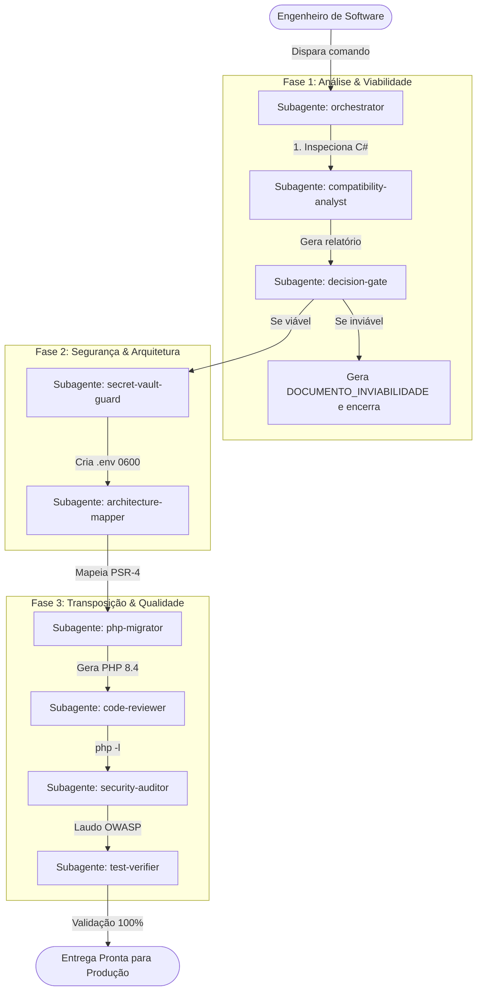

# Integração OpenCode v2 com OpenRouter (GPT-5.6 Luna)

> **Documento Arquitetural e Operacional**  
> **Status:** Ativo / Homologado  
> **Provedor:** OpenRouter (Roteamento Dinâmico por Menor Custo)  
> **Modelo:** `openai/gpt-5.6-luna`  
> **Orquestrador de Subagentes:** OpenCode CLI v2.0+

---

## 1. Contexto & Motivação Arquitetural

No design original do **Code Conversor Agent**, a orquestração do pipeline de conversão de .NET 8 para PHP 8.4 foi implementada como um script Python monolítico com chamadas modulares sequenciais. Embora eficiente para testes determinísticos locais, cenários corporativos exigem agentes autônomos capazes de raciocinar sobre anomalias de código, validar ASTs complexas e invocar ferramentas de linter e compilação em loops interativos de feedback.

A integração com o **OpenCode v2** através do **OpenRouter** resolve três desafios fundamentais:

1. **Especialização de Contexto (Context Isolation):** Cada etapa da migração (análise de viabilidade, extração de credenciais, mapeamento de contratos DDD, transposição, linting, auditoria OWASP e testes) opera sob um subagente isolado com responsabilidade única e prompts focados.
2. **Eficiência Econômica:** Utilização do modelo de ponta **`openai/gpt-5.6-luna`** com roteamento automático pelo provedor com o menor preço em tempo real (`provider: { sort: "price" }`).
3. **Segurança por Padrão (Security-by-Design):** O isolamento estrito de variáveis de ambiente garante que tokens de acesso ao LLM e credenciais de banco nunca sejam expostos no histórico do git ou nos logs de execução.

---

## 2. Topologia do Pipeline de Subagentes



### Inventário de Subagentes (`.opencode/agents/`):

| Subagente | Modo | Responsabilidade Principal |
|---|---|---|
| [`orchestrator.md`](file:///.opencode/agents/orchestrator.md) | `primary` | Coordena a execução sequencial do pipeline, garantindo pré-condições entre etapas. |
| [`compatibility-analyst.md`](file:///.opencode/agents/compatibility-analyst.md) | `subagent` | Varre referências nativas, P/Invoke, GUI ou bibliotecas binárias no C#. |
| [`decision-gate.md`](file:///.opencode/agents/decision-gate.md) | `subagent` | Avalia o relatório; interrompe o fluxo com justificativa se houver blockers. |
| [`secret-vault-guard.md`](file:///.opencode/agents/secret-vault-guard.md) | `subagent` | Extrai credenciais de `appsettings.json`, cria o cofre `.env` com permissão restrita `0600` e atualiza `.gitignore`. |
| [`architecture-mapper.md`](file:///.opencode/agents/architecture-mapper.md) | `subagent` | Mapeia namespaces PSR-4, Value Objects imutáveis e contratos de repositório/serviço. |
| [`php-migrator.md`](file:///.opencode/agents/php-migrator.md) | `subagent` | Transpila o código para PHP 8.4 moderno (`declare(strict_types=1);`, `readonly class`, back-enums). |
| [`code-reviewer.md`](file:///.opencode/agents/code-reviewer.md) | `subagent` | Executa linter sintático (`php -l`) e garante conformidade de estilo. |
| [`security-auditor.md`](file:///.opencode/agents/security-auditor.md) | `subagent` | Auditoria estática contra SQL injection, exposição de secrets e OWASP Top 10. |
| [`test-verifier.md`](file:///.opencode/agents/test-verifier.md) | `subagent` | Executa testes de paridade comportamental e aplica mascaramento dinâmico em logs. |

---

## 3. Configuração do OpenCode (`opencode.jsonc`)

O OpenCode carrega configurações a partir da raiz do repositório ([`opencode.jsonc`](file:///opencode.jsonc)) e faz merge com as configurações globais do usuário em `~/.config/opencode/opencode.jsonc`:

```jsonc
{
  "$schema": "https://opencode.ai/config.json",
  "model": "openrouter/openai/gpt-5.6-luna",
  "default_agent": "orchestrator",
  "provider": {
    "openrouter": {
      "name": "OpenRouter",
      "env": [
        "OPENROUTER_API_KEY"
      ],
      "options": {
        "baseURL": "https://openrouter.ai/api/v1"
      },
      "models": {
        "openai/gpt-5.6-luna": {
          "name": "OpenAI GPT-5.6 Luna (Cheapest Provider)",
          "options": {
            "provider": {
              "sort": "price"
            }
          },
          "headers": {
            "HTTP-Referer": "https://github.com/code-conversor-agent",
            "X-Title": "Code Conversor Agent"
          }
        }
      }
    }
  },
  "permission": {
    "shell": {
      "dotnet *": "allow",
      "php *": "allow",
      "python3 *": "allow",
      "cat *": "allow",
      "ls *": "allow",
      "mkdir *": "allow",
      "chmod *": "allow"
    }
  }
}
```

> **Destaque de Roteamento:** A instrução `"provider": { "sort": "price" }` repassa para o motor de leilão do OpenRouter a diretriz de escolher a menor taxa de token por inferência entre todas as instâncias provedoras do modelo.

---

## 4. Engenharia de Segurança de Credenciais (PAT vs. Inference Key)

Durante a configuração do OpenRouter, uma distinção crítica de segurança deve ser observada:

```
┌────────────────────────────────────────────────────────────────────────┐
│                   TIPOS DE CHAVES NO OPENROUTER                        │
├──────────────────────────────────┬─────────────────────────────────────┤
│ 1. Provisioning Key / PAT        │ 2. Inference API Key                │
│    (is_provisioning_key = true)  │    (is_provisioning_key = false)    │
├──────────────────────────────────┼─────────────────────────────────────┤
│ • Uso: Criar/listar/revogar keys │ • Uso: Chamar /chat/completions     │
│ • Bloqueado em inferência direta │ • Habilitado para inferência LLM    │
│ • Retorna 401 User not found     │ • Retorna 200 OK com completions   │
│   quando chamado em chat         │                                     │
└──────────────────────────────────┴─────────────────────────────────────┘
```

### Boas Práticas Implementadas:
1. **Zero Credenciais Hardcoded:** Chaves de API nunca são escritas em arquivos versionados. O arquivo `opencode.jsonc` declara apenas a variável esperada (`"env": ["OPENROUTER_API_KEY"]`).
2. **Cofre Local `.env` com Permissão Restrita:** O arquivo `.env` na raiz do projeto possui permissões `0600` (`-rw-------`), sendo legível apenas pelo usuário do sistema operacional que executa o processo.
3. **Proteção de Git Automática:** O arquivo `.gitignore` isola `.env`, `.env.local` e diretórios temporários, impedindo vazamento acidental em commits.

---

## 5. Guia de Operação e Execução

### Opção 1: Via Script Automatizado (Recomendada)
O script [`agent-converter/run_opencode_pipeline.sh`](file:///agent-converter/run_opencode_pipeline.sh) encapsula o carregamento seguro do `.env` e invoca o OpenCode com isolamento de sessão:

```bash
# Executar o fluxo completo com o orquestrador mestre
./agent-converter/run_opencode_pipeline.sh

# Ou acionar um subagente específico para uma tarefa pontual
./agent-converter/run_opencode_pipeline.sh security-auditor "Audite o código gerado em target-php-app"
```

### Opção 2: Via OpenCode CLI Direto
Caso prefira invocar diretamente a CLI do OpenCode no terminal:

```bash
# 1. Carregar a variável na sessão atual
export OPENROUTER_API_KEY=$(grep OPENROUTER_API_KEY .env | cut -d'=' -f2 | tr -d '"')

# 2. Executar em modo standalone
opencode run --standalone --agent orchestrator "Inicie a migração completa do projeto"
```

### Opção 3: Interface TUI Interativa
Para acompanhar o raciocínio e a execução das ferramentas visualmente em tela cheia:
```bash
opencode
```
Pressione `Ctrl+P` para alternar entre os subagentes cadastrados (`orchestrator`, `security-auditor`, `test-verifier`, etc.).

---

## 6. Solução de Problemas Comuns (Troubleshooting)

- **Erro `Error: No cookie auth credentials found`:**
  - *Causa:* O OpenCode tentou usar o provedor OpenAI padrão em vez do OpenRouter por falta da variável `OPENROUTER_API_KEY` ou porque a chave informada não era do tipo inferência.
  - *Solução:* Certifique-se de que a variável `OPENROUTER_API_KEY` esteja presente no terminal (`echo $OPENROUTER_API_KEY`) com uma chave válida de inferência (não PAT).
- **Erro `User not found (code: 401)` do OpenRouter:**
  - *Causa:* Uso de uma chave do tipo *Provisioning Key*.
  - *Solução:* Crie uma API Key padrão em [openrouter.ai/keys](https://openrouter.ai/keys) com permissão de consumo de créditos para inferência.
- **Caminhos no WSL vs. Windows Explorer:**
  - Para abrir os arquivos de configuração do OpenCode diretamente no Explorer do Windows a partir do WSL:
    ```bash
    explorer.exe .
    # Ou para a pasta global:
    explorer.exe ~/.config/opencode
    ```
